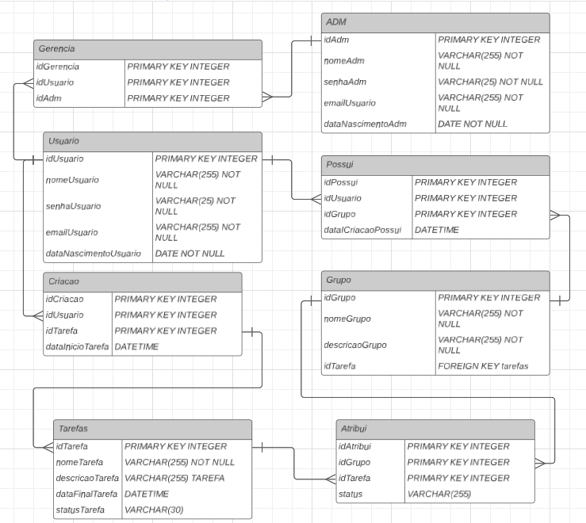

# Escopo do Projeto

## Descrição Geral
A aplicação web de To-Do List será desenvolvida utilizando React para o frontend, Node.js para o backend, MongoDB para o banco de dados e JWT para autenticação. O sistema permitirá aos usuários adicionar, editar, excluir e organizar suas tarefas de forma eficiente, enquanto a segurança e a escalabilidade são garantidas pelas tecnologias escolhidas. A aplicação será direcionada a pessoas com a necessidade de criar uma lista de tarefas.

  
<strong>Escopo</strong>

## Objetivos Gerais
- Desenvolver uma interface de usuário intuitiva e responsiva para gerenciamento de tarefas.
- Implementar funcionalidades de CRUD (Create, Read, Update, Delete) para as tarefas.
- Garantir a segurança dos dados e a proteção das informações do usuário.
- Criar uma solução escalável que suporte um número crescente de usuários e tarefas.

## Metas SMART

### Específicas
- Implementar a autenticação de usuários com JWT.
- Desenvolver o frontend com React e o backend com Node.js.
- Utilizar MongoDB para armazenar dados de tarefas e usuários.
- Garantir que a aplicação seja segura, escalável e de fácil uso.

### Mensuráveis
- A aplicação deve suportar até 1000 usuários simultâneos sem degradação do desempenho.
- Cada usuário deve poder gerenciar até 50 tarefas sem problemas de performance.

### Atingíveis
- Criar funcionalidades básicas e avançadas de gerenciamento de tarefas.
- Implementar autenticação segura e controle de acesso.
- Realizar CRUD completo para tarefas e usuários.
- Garantir uma interface responsiva e intuitiva.

### Relevante
- A aplicação deve atender às necessidades de organização e produtividade dos colaboradores da Escola SENAI.
- Facilitar a gestão de tarefas com uma interface moderna e recursos de segurança robustos.

### Temporal
- Desenvolvimento e lançamento da aplicação devem ser concluídos em 2 meses.
- Reuniões de acompanhamento semanais para revisar o progresso e ajustar o cronograma conforme necessário.

## Recursos
- **Frontend**: React
- **Backend**: Node.js
- **Banco de Dados**: MongoDB
- **Autenticação**: JWT
- **Design de Interfaces**: Figma
- **IDE para Desenvolvimento**: VSCode
- **Documentação**: README (GitHub)
- **Controle de Versão**: GitHub

## Recursos Humanos
- **Desenvolvedores Frontend**: 2
- **Desenvolvedores Backend**: 2
- **Desenvolvedor de Banco de Dados**: 1
- **Designer UI/UX**: 1
- **Estagiário**: 1

## Análise de Riscos
### Riscos e Soluções
- **Problemas de Performance**: Implementar técnicas de otimização e escalabilidade, como indexação de banco de dados.
- **Vulnerabilidades de Segurança**: Implementar práticas de segurança recomendadas, como validação de entrada, criptografia de senhas e uso de HTTPS.
- **Desvios no Cronograma**: Monitorar o progresso regularmente e ajustar o cronograma conforme necessário para garantir a entrega no prazo.
- **Incompatibilidade entre Frontend e Backend**: Definir claramente as APIs e realizar testes de integração frequentes.
- **Mudanças nos Requisitos**: Manter uma comunicação constante com os stakeholders e documentar todas as alterações nos requisitos.

  
<strong>Cronograma do Projeto</strong>

  
<strong>Diagramas para Desenvolvimento</strong>

### Diagrama de Classe:

### Diagrama de Uso:

### Diagrama de Fluxo:

# 

## Conclusão
Este plano fornece uma base sólida para o desenvolvimento da aplicação web de To-Do List, garantindo que todos os aspectos críticos sejam abordados. Seguir este plano ajudará a assegurar que o projeto seja entregue com sucesso, atendendo às necessidades dos usuários da Escola SENAI e aplicando as melhores práticas de desenvolvimento moderno. Se precisar de mais detalhes ou ajustes específicos, estou aqui para ajudar!
