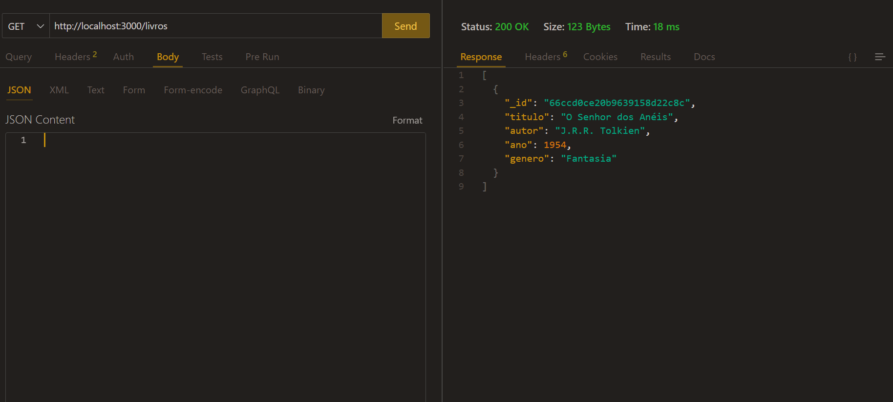
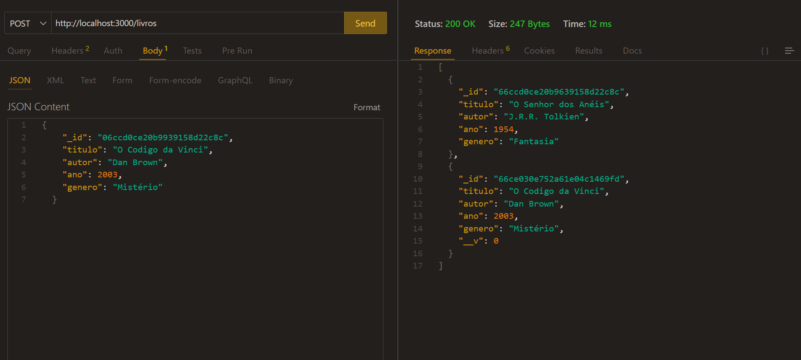
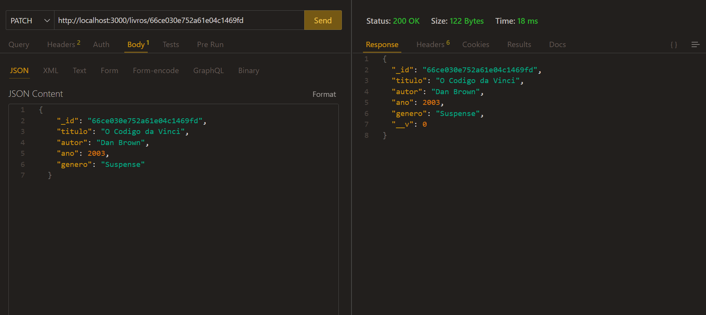
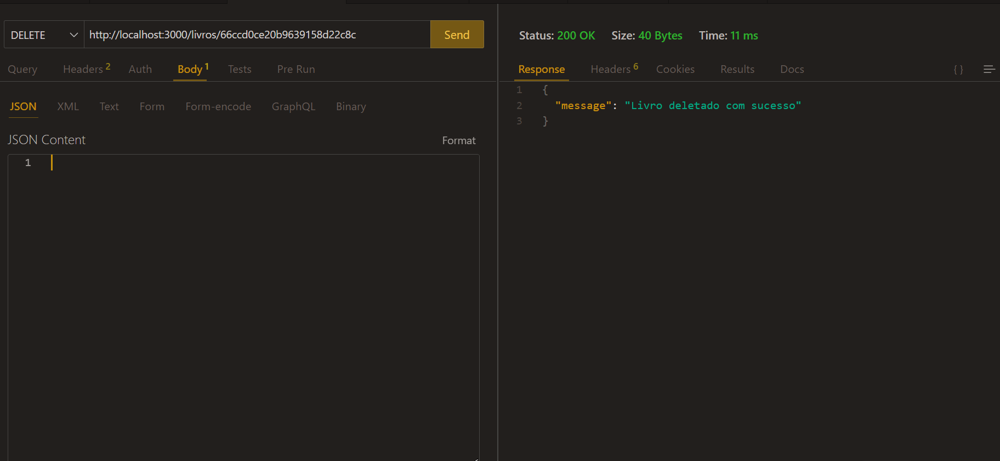

# Sistema Biblioteca

  
<strong>Realização Testes</strong>

### Method Get:

#### - Listando todos os valores presentes na coleção:

### Method Post:

#### - Realizando a criação de um valor na coleção:

### Method Patch:

#### - Alterando um valor especifico na coleção:

### Method Delete:

#### - Deletando o valor na coleção:

